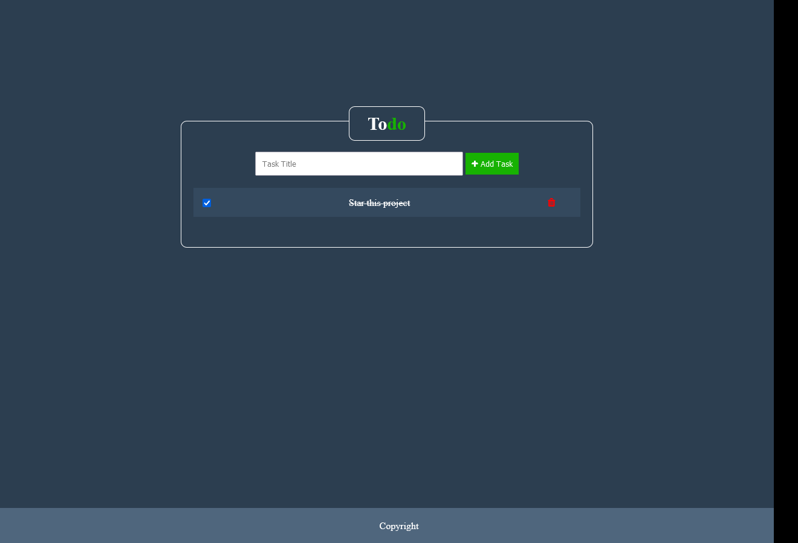

# Todo list
Todo app with Laravel 8 & Vuejs

### Features
- Add task
- Mark task as completed
- Delete task

### Installation

1. Run command `git clone https://github.com/moataseme/todo.git`
2. Go to project folder (todo) or Run command `cd todo`
3. Rename `.env.example` to `.env`
4. Run command `composer install`
5. Run command `npm install`
6. Add database credentials to `.env`
7. Run command `php artisan migrate`
8. Run command `php artisan key:generate`
9. Run command `php artisan serve`
10. Open `localhost:8080` or full link ex. `localhost/{project-path}/public` in the browser
